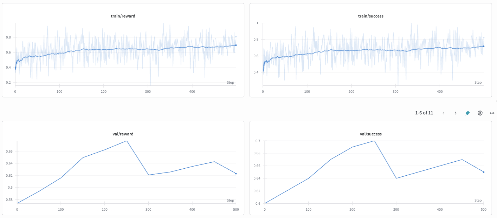

+++
date = '2025-08-12T06:48:59+01:00'
draft = false
title = 'Towards Smarter Computers: Training Small Models to Use the Terminal'
tags = ['software', 'rl', 'data']
+++
# TL;DR
I bring you:
- Sandboxing environment to train shell agents: [repo](https://github.com/deathbyknowledge/sos)  
- A 14k shell task dataset for training on [HF](https://huggingface.co/datasets/deathbyknowledge/shell-tasks)
- Synthetic data generation pipeline to generate customizable task datasets
- Batteries-included script to run RL with the above and your model of choice

# Intro
Earlier this year I started messing more with "agents", so much more that it ended up changing what I do at work (cool).

One of my side projects for experimenting was [Quorra](https://github.com/deathbyknowledge/quorra), it helped me get comfortable with LLMs and seeing what their limitations were.
I don't spend time on it anymore but it introduced the idea of **"shell agents"** in my head.

# Oh, you mean like Claude Code?
Yes and no, sort of. [CC](https://docs.anthropic.com/en/docs/claude-code/overview), [Cursor](https://cursor.com/features), [Gemini CLI](https://github.com/google-gemini/gemini-cli) and frens all have some sort of shell command line support, so they can work on your repository freely but that's not what I'm referring to.

Although _yes_, they can run commands, they are mainly optimized to edit code. I want a tool that I can fire off with a prompt/task, from anywhere in my computer and have it be smart enough to accomplish its goal. If I can perform a task (whatever that might be) in my terminal, why can't an LLM?

Perhaps you can **force** one of the aforementioned tools paired with a big LLM to get some of those workflows right, but why not have a small local model do so? 

# Why on Earth would you want that?
I hear you already "NOO YOU CAN'T JUST GIVE UNSANDBOXED ACCESS TO YOUR COMPUTER", yeah no shit. But hear me out:

A lot of what we're trying to build into "personal agents" is already provided in personal computers (Unix). In fact, we spent A LOT of time getting that right. So why not re-use it to make computers _easier_ to use? (I am not saying **2025 is the year of agents AND desktop Linux**, I promise).
- "find that resume I wrote late last year and put it in my home folder" (pure `find` and `mv`)
- "make a dataset reader for /mydataset.jsonl, serve it and open it in my browser" (`echo`, `python`, `open`)
- "make sure we backup /Documents every week" (`tar`, `cron` and `rclone`)
- "woah chrome just crashed, can you find out why?" (`find`, `tail`, `grep`, etc. You get the idea)

I don't want to open Chat apps for that though, I just want to be able to spawn "smart processes" and let them do their With some guardrails and interface, ofc, but you get the point. Also, for production workflows:
- You maintain an old af app that randomly breaks and it's a hassle to debug? Save hours by automatically spawning one of these to do a first round of debugging and hopefully fixing. Otherwise let it just write down its findings and alert.
- Huge K8s cluster? I haven't heard a single person that enjoys ssh-ing into clusters or pods to debug some of this stuff, either we're automating devops or making cool "smart probes". This can save a great deal of time!

If you're building agents, you know how painful it is to model your tools. If you make your models converge into native shell users, you can model your tools as CLIs (which we've done for years) and have the model use them.

# Training SLMs for shell use
This is where the blog post starts. Some of the previous examples are "goals" of where we might want to go, but we're very far.
Why don't we have this already? Well, these smaller models are harder to get to do exactly what you want so we need to train them further. Here, I'll show how to use Reinforcement Learning to improve (simple-ish) shell task performance.

We'll need:
- Data! We need lots of examples of what these "shell tasks" can look like.
- High-fidelity sandbox environment to use while training.

## Data
Let me show you an example of what one of these tasks can look like:

>During a system audit, you need to verify the permissions of all executable files in '/usr/local/bin'. List all files with execute permissions for the owner but not for the group or others, and save the list to '/tmp/restricted_executables.txt'.

Not all tasks are created equal, this would be an easier one:

>The 'zeus-database' service has left behind orphaned lock files in '/run/zeus'. Remove all files with the '.lock' extension in this directory.

This is good but there are 2 extra things to take into account:
- Tasks might need the environment to be set up first (e.g. creating files, folders, changing permissions, etc)
- We need a way to deterministically check whether the task was successfully completed or not. (We want this to reward our models)

Thus, I generated and validated a synthetic dataset of ~14k tasks, each including setup commands and a success check that exits 0 on success, non-zero otherwise.

You can find it here: https://huggingface.co/datasets/deathbyknowledge/shell-tasks

## High-fidelity Environment
As funny as it is to imagine what would happen if we ran training with, say, 64 agents running differnet commands on a training node, we need to take this a tad bit seriously and make proper sandboxing.

What are we after?
- Sandboxes are high-fidelity. Make it hard to tell that it's not a native shell session.
- Easy to run commands as part of a session, not losing state between commands. (aka shell process must remain the same)
- The environment can extract the output and exit code from each command. Exit codes are specially good for model rewards!
- Sandboxes are hard to jailbreak.
- Highly customizable.

Thus, I made [Sea of Simulation](https://github.com/deathbyknowledge/sos), a Rust HTTP service that manages Docker containers to hide away all the ugly bits and expose a simple API for handling high-fidelity shell sandboxes. You can customize the Docker image and setup commands for each sandbox, so it can be tailored to specific workflows.

Since containers can suffer under resource contraints, you can configure concurrency for the running sandboxes at a given time.
It's fairly easy to read, so if you're interested you can have a look at the tests to see how it works.

# Putting it all together
In the SoS repo you can find 2 Python examples:
1. A [synthetical data generation pipeline](https://github.com/deathbyknowledge/sos/blob/main/examples/synthetic_generator/generation.py#L13), using SoS to validate that setup commands work, success condition fails when no actions are taken and later to run full rollouts from LLMs to validate the solvability.
2. An [RL training script](https://github.com/deathbyknowledge/sos/tree/main/examples/rl), which trains SLMs to solve tasks while running the sandboxing through SoS. Rewards depend on success condition passing, number of non-zero error codes and number of turns taken. Uses [ART](https://github.com/OpenPipe/ART) for training.

# First experiment results
Disclaimer: I am very new to training and I've got a lot of intuition to learn still, so if you see something terribly wrong here please let me know lol.

Using Qwen2.5-7B (slightly SFTd so it knows it's in a shell, forcing CoT with `#` comments) I did see an improvement, although a bit flaky. I'll need to set a proper run that runs for a way longer and iterates the entire dataset.

Dunno, what I take from this is that reward is very spiky due to being mostly binary reward? Also, seems to learn but slooooowly, great news for someone GPU poor like me :') . [Prime Intellect](https://www.primeintellect.ai/) spot instances have been an awesome resource for short experiments though!

# What's next?
A lot, this is merely personal research I'm interested in and great learning experience (you have no idea the hassles I've gone throguh  to get stable container IO).

Things currently in my mind:
- Improve quality of the dataset by increasing diversity of tasks.
- Rewards are sequence level, seems like a good spot to try out GSPO.
- Train on custom tools. Teach the models to learn to call `-h` when missing commands. (They don't always do this)
- Multi-GPU training.
- Do multiple runs with different parameters and model sizes, see what works.
- Run RL directly without SFT step. Check if I'm brain frying them with it.
- Many more!

If you have any feedback or ideas, I'd love to hear it! Reach out on [X](https://x.com/caise_p).
