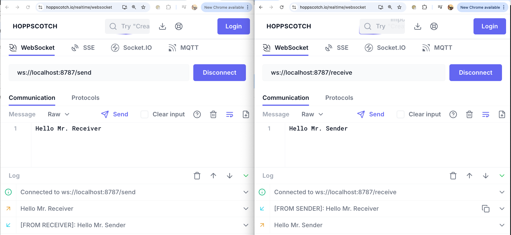

+++
date = '2025-01-31T17:22:07+01:00'
draft = false
title = 'YSTP: Cloudflare Workers and Durable Objects tutorial (Pt. 2)'
summary = " "
+++

This is the second part of the **YSTP** series. Make sure you .


This was written with goal of making the content educational and not provided to be production-ready as is. Assess at your own risk.


# Requirements
In order to follow along the tutorial and run the projectA draft repository can be found <a href="https://github.com/deathbyknowledge/ystp">here</a>. locally, you'll just need [Node.js](https://developers.cloudflare.com/workers/get-started/guide/#prerequisites). 

If you want to **deploy your own**, you'll need a Cloudflare account with the **Workers Paid** plan (5$/mo) as Durable Objects are only available then. Still, great deal.

# Creating a Workers and Durable Objects base project
Let's get down to business. This part is pretty straightforward, you just need to run:
```sh
npm create cloudflare@latest -- ystp
```

In the prompts, just pick the following:
- `What would you like to start with?` -> **Hello World Example**
- `Which template would you like to use?` -> **Hello World Worker Using Durable Objects**
- `Which language do you want to use?` -> **TypeScript** (be civil)
- `Do you want to deploy your application?` -> **No** (be civil x2)

After this you should have a starting project ready to give it a go. It's easy to run it locally, so leave a terminal running by running:
```sh
cd ystp
npx wrangler dev
```

# Starting point

Feel free to look around the template if you want but I'll strip down the `src/index.ts` to the following 

```typescript
import { DurableObject } from "cloudflare:workers";

// Durable Object
export class MyDurableObject extends DurableObject<Env> {
  constructor(ctx: DurableObjectState, env: Env) {
    super(ctx, env);
  }

  async fetch(request: Request): Promise<Response> {
    return new Response("Hello world!");
  }
}

// Worker
export default {
  async fetch(request, env, ctx): Promise<Response> {
    let id: DurableObjectId = env.MY_DURABLE_OBJECT.idFromName(new URL(request.url).pathname);
    let stub = env.MY_DURABLE_OBJECT.get(id);
    return await stub.fetch(request);
  },
} satisfies ExportedHandler<Env>;
```

Our entrypoint the **Worker**'s `fetch` function, which is instantiatingWorth noting, each instance of the <b>DO</b> has its own separate storage. a **Durable Object** by creating an id from a human readable string, in this case the pathname of the request. It then lets the **DO** handle the request through its `fetch` method (the only method that can return `Response`s directly from the **DO**).

You can check it's working by:
```sh
sam@flynn:/tmp/ystp$ curl localhost:8787/
Hello world!%
```

# Updating the name of the DO 

Before we move on with building _the thing_, let's update the name of our **DO** to accurately describe what it'll do, so we'll name it `Relay`. Besides **updating the name of the class** add the following changes to your `wrangler.json`
```json
{
//...
  "migrations": [
    {
      "new_classes": [
        "Relay"
      ],
      "tag": "v1"
    }
  ],
  "durable_objects": {
    "bindings": [
      {
        "class_name": "Relay",
        "name": "RELAY"
      }
    ]
  }
//...
}
```

That will not be enough, as we haven't updated the TS types. To do, so run:
```sh
npm run cf-typegen
```

Now we can update the **Worker**'s `fetch` to use the updated bindings:

```typescript
    // ...
    let id: DurableObjectId = env.RELAY.idFromName(new URL(request.url).pathname);
    let stub = env.RELAY.get(id);
    // ...
```

You should have no type errors and the server should still be working now. So let's move on.

# Building a relay 
We'll start by allowing 2 parties to communicate, forgetting about the file sharing for now. Let's get the WebSocket relay sorted first.

We need to differentiate between the 2 clients, so we'll allow 2 paths: `/send` and `/receive` and handle them differently.
Update the **Worker**'s `fetch`:
```typescript
//...
	async fetch(request, env, ctx): Promise<Response> {
		// Make sure it's a WebSocket request
		if (request.method == 'GET' && request.headers.get('Upgrade') == 'websocket') {
			// Make sure it's one of the expected paths
			if (request.url.endsWith('/send') || request.url.endsWith('/receive')) {
				let id: DurableObjectId = env.RELAY.idFromName('1234'); // We'll update this later.
				let stub = env.RELAY.get(id);
				return await stub.fetch(request); // Handle the request in the DO
			}
			return new Response(null, { status: 404 }); // Unsupported path
		}

		return new Response('Expected WebSocket upgrade', { status: 426 });
	},
//...
```

The changes are pretty much self-explanatory but to summarise we're now making sure all requests are WebSocket requests and we're only allowing `/send` and `/receive` paths.

A more subtle change is that we've hardcoded the **DO** id we're going to use (as we can't use the pathname anymore, since `/send` and `/receive` would instantiate and communicate with different **DO**s).

We can now update the **DO** to handle the 2 requests and accept the WebSocket connections.
```typescript
  //...
  async fetch(request: Request): Promise<Response> {
		// Get WebSocket pair
		const webSocketPair = new WebSocketPair();
		const [client, server] = Object.values(webSocketPair);

		// Accept WebSocket and set appropriate tag so we can find it later.
		if (request.url.endsWith('/send')) {
			this.ctx.acceptWebSocket(server, ['sender']);
		} else {
			this.ctx.acceptWebSocket(server, ['receiver']);
		}

		// Return the client side of the connection with 101 Switching Protocols.
		return new Response(null, {
			status: 101,
			webSocket: client,
		});
	}
  //...
```

Cool. This code is quite simple too but let me go over it. We're getting the `client` and `server` side of the WebSocket connection.

We can then accept the server side of the connection with `this.ctx.acceptWebSocket` and can pass in an optional array of tags we want to add to this connection. You'll see why this is important shortly .

Once we've accepted the server side of the connection we "return" the client side and we can consider it established.

That's great and all but we're neither sending nor receiving any messages. How can we do that? Let's add some more code to the **DO**:
```typescript
//...
  handleSenderMessage(message: ArrayBuffer | string) {
    const [receiver] = this.ctx.getWebSockets('receiver');
    receiver.send(`[FROM SENDER]: ${message}`)
  }

  handleReceiverMessage(message: ArrayBuffer | string) {
    const [sender] = this.ctx.getWebSockets('sender');
    sender.send(`[FROM RECEIVER]: ${message}`)
  }

  webSocketMessage(ws: WebSocket, message: ArrayBuffer | string) {
    const [tag] = this.ctx.getTags(ws);
    switch (tag) {
      case 'sender': this.handleSenderMessage(message); break;
      case 'receiver': this.handleReceiverMessage(message); break;
    }
  }
//...
```

The **DO** has a `webSocketMessage` method that acts as a callback on every WS message received. It makes both the **WebSocket** that sent the message _and_ the message accessible.

Since we tagged the connections when accepting them, we can tell them apart. We then keep it clean by handling each in a different method, which effectively relays the message to the other party.

# Testing the relay
And that's pretty much it. We should have a working relay, let's try it out. You can use any WebSocket client you want (or write the code yourself) but I'll use a browser version so it nicely fits in a screenshot 😇.


You can see both clients were able to establish a connection and send messages that the other party received. All relayed by the **DO**.

# Building YSTP
We now have some solid foundations for what we want to do. There are some tricky concepts with what we've done so I'll leave it here so you can play around and I'll start implementing **YSTP** in  of the series.

See ya then!

