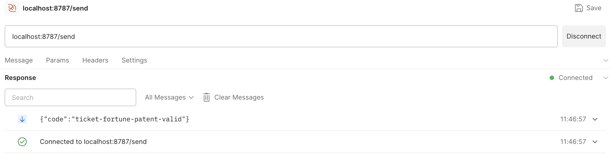
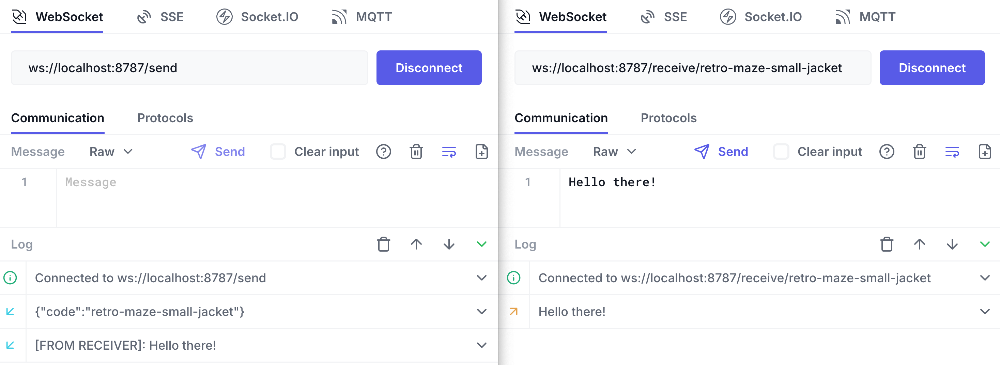
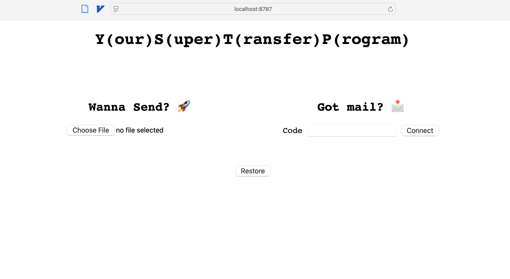

+++
date = '2025-02-01T10:01:07+01:00'
draft = false
title = 'YSTP: Cloudflare Workers and Durable Objects tutorial (Pt. 3)'
summary = " "
+++

This is the last part of the **YSTP** series, make sure you've read  and . Make sure you read the other entries first.

# Recap
We left off last time with a working relay. Let's set it up so we can build the file sharing as we showed.

Before we do that though, you saw how our route handling was mediocre. Let's quickly set up [Hono](https://hono.dev/) to make it easier for us.

# Adding Hono
Install the dependency:
```sh
npm i hono
```

In `index.ts` you can now delete the **Worker** code and replace it with: 

```typescript
//...
import { Hono } from 'hono';
import { createMiddleware } from 'hono/factory'

// DO code ...

// New Worker code
type Bindings = {
  RELAY: DurableObjectNamespace<Relay>
}

const app = new Hono<{ Bindings: Bindings }>();

const ws = createMiddleware<{ Bindings: Bindings }>(async (c, next) => {
  const upgrade = c.req.header('Upgrade');
  if (upgrade != 'websocket')
    return new Response("Expected websocket upgrade", { status: 426 });
  await next();
});

app.on('GET', ['/send', '/receive'], ws);


app.get('/send', (c) => {
  const id = c.env.RELAY.idFromName('1234');
  const stub = c.env.RELAY.get(id);
  return stub.fetch(c.req.raw);
});

app.get('/receive', (c) => {
  const id = c.env.RELAY.idFromName('1234');
  const stub = c.env.RELAY.get(id);
  return stub.fetch(c.req.raw);
});

export default app;
```

You can see that routing has been simplified greatly. We now have 2 handlers, one for `/send` and one for `/receive` (doing the same for now). We've also moved the WebSocket validation to a middleware that we run on both of those paths.

The behavior shouldn't have changed at all. You should still be able to get the same results. Moving on.

# Session codes
Of course, we still have a hardcoded **DO** id, namely '1234', so let's fix that :)

We want to generate the session code when the sender connects and use that as the **DO** id, so let's do that. We want the code to be easy to share verbally, so we'll use a wordlist of easy to remember words ([credit](https://github.com/schollz/mnemonicode/blob/master/word_list.go)).

First add a new file `mnemonic.ts` with:

```typescript
// https://github.com/schollz/mnemonicode/blob/master/word_list.go#L17-L289
const MNEMONIC_LEN = 4;

// Generates a code like "plate-join-bundle-job".
export const mnemonic = () => {
    const words = [];
    for (let i = 0; i < MNEMONIC_LEN; i++) {
        const randIdx = Math.floor(Math.random() * (wordList.length - 1));
        words.push(wordList[randIdx])
    }

    return words.join('-');
};

const wordList: string[] = [
  //paste the wordlist here...
];
```

There's not much going on in it besides just grabbing random words from the list and joining them with '**-**'. The fun comes when we actually get to use the thing. So back to the `index.ts`:

## Sender
```typescript
// other imports...
import { mnemonic } from "./mnemonic";

// ...
app.get('/send', (c) => {
  const code = mnemonic(); // "plate-join-bundle-job"
  const id = c.env.RELAY.idFromName(code); // "8271c5f2b3d4cbfa2f77da2a0a60fea24f8969262eac903b8a279db307eba6b9"
  const stub = c.env.RELAY.get(id);
  return stub.fetch(c.req.raw);
});
//...
```

Perfect, we can now generate unique codes for every **sender**. Mind you, the **sender** has no idea of what code was generated, so we must send it back from the **DO** in a message.

There is one small caveat here. From inside the **DO** we _can_ access its own id but **not** the `name` it might've been given<a>https://community.cloudflare.com/t/how-can-i-know-the-name-of-a-durable-object-within-the-object/290384/2</a>.

No biggie though, we'll just add it as a header in the request before passing it on to the **DO**.

```typescript
// ...
app.get('/send', (c) => {
  const code = mnemonic(); // "plate-join-bundle-job"
  const id = c.env.RELAY.idFromName(code); // "8271C5F2B3D4CBFA2F77DA2A0A60FEA24F8969262EAC903B8A279DB307EBA6B9"
  const stub = c.env.RELAY.get(id);

  // Create a new Request object since Hono's
  // req is immutable.
  const req = new Request(c.req.raw)
  // Set the Code header with our own code.
  req.headers.set('Code', code);

  return stub.fetch(req);
});
//...
```

Now we just have to send the code back in the **DO**:

```typescript
    // other fetch code ...
    if (request.url.endsWith('/send')) {
      this.ctx.acceptWebSocket(server, ['sender']);

      // Send mnemonic as first message.
      this.ctx.waitUntil(new Promise(res => {
        server.send(JSON.stringify({ code: request.headers.get('Code') }));
        res(null);
      }));
    } else {
    // other fetch code ...
```

That might look a bit more complicated than expected, but effectively we're just using the server side of the connection to send a JSON message with the code in it.

_But_ since the connection is only properly established once we've returned the **101** Response, I'm using `this.ctx.waitFor` to tell the **DO** to "stick around" after the Response is sent and fulfill the promise it's given (sending the WebSocket message).

We can test it works by simply connecting with the sender.


## Receiver
Now we must have the receiver connect by providing a code. We'll have the receiver connect with the code as a path parameter (e.g. `/receive/plate-join-bundle-job`). Hono will handle everything for us, so we can simply do:

```typescript
//...
app.on('GET', ['/send', '/receive/*'], ws);
//...
app.get('/receive/:code', (c) => {
  const id = c.env.RELAY.idFromName(c.req.param('code'));
  const stub = c.env.RELAY.get(id);
  return stub.fetch(c.req.raw);
});
//...
```

That's all we needed. We should now be able to communicate just as before but with private relays for every sender!



# File transfer, finally
Let's create an `enum` with all the steps we expect to happen:
```typescript
// imports...
enum Step {
  Created,
  WaitingMetadata,
  WaitingReceiver,
  WaitingApproval,
  Transfer
}
//...
```
1. **Created**: Relay is created. Sender has successfully upgraded protocol to WebSocket. Relay sends the first message with the session code.
2. **WaitingMetadata** Relay is waiting for sender to send the file
    metadata.
3. **WaitingReceiver**: Sender has sent the metadata, Relay has stored it and is now waiting for receiver to connect.
4. **WaitingApproval**: Relay is waiting for receiver's approval to
   start transfer.
5. **Transfer** Transfer has started and all incoming messages
   from sender are relayed to the receiver until `EOF`.

Let's now add the methods to keep track of the step from within the **DO**:

```typescript
//...
  async currentStep(): Promise<Step> {
    return (await this.ctx.storage.get('step') as Step) || Step.Created;
    // Don't worry, there's built-in caching.
  }

  async setStep(step: Step) {
    this.ctx.storage.put('step', step);
  }
//...
```

This storage will be available even if the **DO** is evicted from memory. Let's start using them starting with the Relay's `fetch`:
```typescript
    //..
    if (request.url.endsWith('/send')) {
      this.ctx.acceptWebSocket(server, ['sender']);
      // Ready to receive metadata through WS.
      this.setStep(Step.WaitingMetadata);
      // Send mnemonic as first message
      this.ctx.waitUntil(new Promise(res => {
        server.send(JSON.stringify({ code: request.headers.get('Code') }));
        res(null);
      }));
    } else {
      if (await this.currentStep() != Step.WaitingReceiver) {
        return new Response('Session is not ready, try again later.', { status: 423, webSocket: client, });
      }
      this.ctx.acceptWebSocket(server, ['receiver']);

      // Ready to receive approval through WS.
      this.setStep(Step.WaitingApproval);
    }
    //...
```

All in all, we're now making sure we only accept receivers on the right step *and* that we update the **Step** after we accept either connection.

Before we move on let's add some helper methods:
```typescript
  // ...
  // Inside Relay
  private _sender?: WebSocket;
  private _receiver?: WebSocket;
  // ...

  sender(): WebSocket {
    if (this._sender) return this._sender; // Not sure if getWebSockets is cached
    const [sender] = this.ctx.getWebSockets('sender');
    this._sender = sender;
    return sender;
  }

  receiver(): WebSocket {
    if (this._receiver) return this._receiver;
    const [receiver] = this.ctx.getWebSockets('receiver');
    this._receiver = receiver;
    return receiver;
  }

  shutdown() {
    this.receiver().close();
    this.sender().close();
    this.ctx.storage.deleteAll(); // This ensures the DO is deleted.
  }
  // ...
```

We're basically writing the same code we wrote before to get the sender and receiver connections but we're caching them in a class property.
There's also a `shutdown` method that we can use when we're done with the **DO**.

Let's now update the `handleSenderMessage`:

```typescript
  // ...
  async handleSenderMessage(message: ArrayBuffer | string) {
    switch (await this.currentStep()) {
      // Sender sends file metadata
      case Step.WaitingMetadata: {
        if (typeof message == 'string') {
          const { name, size } = JSON.parse(message);
          await this.ctx.storage.put('metadata', { name, size });
          this.setStep(Step.WaitingReceiver);
        }
        break;
      }
      // Sender sends chunk
      case Step.Transfer: {
        if (typeof message == 'string' && message == "EOF") {
          this.receiver().send(message);
          this.shutdown();
        } else {
          this.receiver().send(message);
        }
        break;
      }
    }
  }
  // ...
```
We're only expecting messages from the Sender in 2 steps, so we only deal with them.
*If* the step is `WaitingMetadata`, the message must be the file metadata so we store it in storage too.

*If* the step is `Transfer`, the message will either be a chunk (array of bytes) we'll simply relay the message to the receiver. If the message was "EOF", then we'll also relay it but proceed to shut down the **DO** afterwards.

Let's now update the receiver side:
```typescript
  // ...
  async handleReceiverMessage(message: ArrayBuffer | string) {
    switch (await this.currentStep()) {
      // Receiver sends approval to start transfer.
      case Step.WaitingApproval: {
        if (typeof message == 'string' && message == 'LET_IT_RIP') {
          await this.setStep(Step.Transfer);
          this.sender().send(message);
        }
        break;
      }
    }
  }
  // ...
```
We only expect messages from the receiver when waiting for approval, so we treat "LET_IT_RIP" as our approval message and relay it and set the step as `Transfer`.

The last bit we're missing in the Relay now is sending the metadata to the receiver, which we can do right when it connects. So:

```typescript
      // ...
      if (await this.currentStep() != Step.WaitingReceiver) {
        return new Response('Session is not ready, try again later.', { status: 423, webSocket: client, });
      }
      this.ctx.acceptWebSocket(server, ['receiver']);

      // Send metadata as first message
      const metadata = await this.ctx.storage.get('metadata');
      this.ctx.waitUntil(new Promise(res => {
        server.send(JSON.stringify(metadata));
        res(null);
      }))

      // Ready to receive approval through WS.
      this.setStep(Step.WaitingApproval);
      // ...
```

# HTML client
You can find the entire client [here](https://github.com/deathbyknowledge/ystp/blob/master/src/index.html). It's not pretty but it effectively does the job, you're welcome to implement your own.

You can add it under `public/index.html` (you'll have to create the folder.

To have it served as a static asset, update `wrangler.json`:
```json
{
  // ...
  "assets": {
    "directory": "./public"
  },
  // ...
}
```

After a server reload, you should have it available and... we're done!



# Deploying
If you have a Cloudflare account with the **Workers Paid** plan, deploying is as easy as running:
```sh
npm run deploy
```

# Thank you
Thank you for making it this far! Hopefully you had as much fun following along as I did putting it together. **Do not** follow me or anything, leave me alone. Thanks again 😇.
